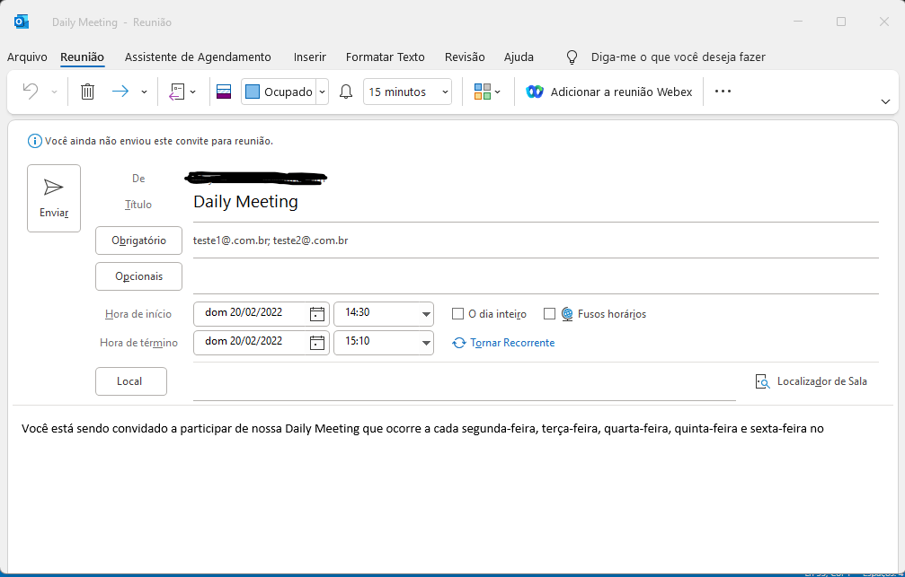

<h1 align="center">


<h3> <p align="center">DAILYMEET </p> </h3>

<h3> <p align="center"> ================= </p> </h3>

>> <h3> Resume </h3>

<p> This project is to help in the routine of meetings of a company.
Every day we must carry out a traditional daily to inform our procedures within the company. This program comes to facilitate whenever necessary the date exchange settings, inclusion of new emails, inclusion or change of new meeting locations, in short, it comes to help this.
Obs: Only works on Windows operating systems </p>

>> <h3> How install </h3>

```
pip install dailyMeet==5.0.0

```
>> <h3> How Works </h3>

```

from dailyMeet import *

dailyMeet()

```

>> <h3> Output </h3>

<p> <i> Informe onde será realizado a reunião: 
Escolha o dia da reunião: 20
Escolha o mês da reunião: 02
Escolha a hora de inicio da reunião: 14
Escolha os minutos da reunião: 30
A duração (em minutos) da reunião: 40
Quantas pessoas deseja reunir na daily? 2
Digite o e-mail nº1: teste1@.com.br
Digite o e-mail nº2: teste2@.com.br
Escolha uma opção:
    [1] - Enviar Email Direto,
    [2] - Visualizar antes de enviar
    R: 2
Painel aberto no outlook </i></p>

>> <h3> Sample </h3>

